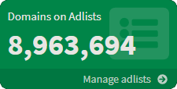

<div align="center">
    <h1>
        The best Blocklist Collection<br> made by Sefinek ✋
    </h1>
    
    <br><br>
    
    
    <br>
    <a href="https://blocklist.sefinek.net/#stats" target="_blank">View more stats... »</a>
</div>
<br>
<div align="center">
    
    <br>
    <p>⭐ If you found this repository helpful or interesting, please consider giving it a star to show your support!</p>
    <b>Have fun and stay safe!</b> o(>ω<)o 👋
</div>

## 💸 Support me
Unfortunately, **my home internet connection doesn't allow me to host a blocklist**, so I'm asking for your support. Every donation will be helpful, and the VPS server will be available all the time. Additionally, this project will be continuously supported by me. Thank you! 😹😻
> https://sefinek.net/support-me  (Patreon, Ko-fi, GitHub Sponsors, Stripe)  
> https://paypal.me/sefinek (email for PayPal: contact@sefinek.net)


## 📝 More information
Visit the official website of the project [blocklist.sefinek.net](https://blocklist.sefinek.net) to get more details.


## 📦 How to acquire the blocklist?
You have two options for acquiring the blocklist.
- The first option is to [generate your own list](https://sefinek.net/blocklist-generator), which is recommended for all users as it allows for customization based on specific needs and preferences.
- The second option is to utilize the [default list](https://github.com/sefinek24/Sefinek-Blocklist-Collection/tree/main/docs/lists/md) provided.
This may be suitable for those who prefer a quick and straightforward solution without the need for customization.


## ❌ How to Report a False Positives?
You can report a false positive by creating a new [Issue](https://github.com/sefinek24/Sefinek-Blocklist-Collection/issues), sending me a message on [Discord](https://sefinek.net), or through [email](https://sefinek.net).
Within 48 hours, I will add the domain or subdomain to the [whitelist](whitelists/main.txt).
Shortly thereafter, the false positive will be automatically removed from the blocklist via [GitHub Actions](.github/workflows/generate-blocklists.yml).
The blocklists on the primary server ([blocklist.sefinek.net](https://blocklist.sefinek.net)) are updated every 25 hours (cron schedule: 0 1,6 * * *).

### ⏰ Can I create a Pull Request and add a false positive to the whitelist?
Of course, you can definitely create such a [Pull request](https://github.com/sefinek24/Sefinek-Blocklist-Collection/pulls). Remember to follow the required syntax!
You can find it at the very top of the [whitelists/main.txt](https://github.com/sefinek24/Sefinek-Blocklist-Collection/blob/main/whitelists/main.txt#L10) file.


## 📥 Update frequency
- **Repository:**  
The blocklists in this repository are updated every `2 hours` by [GitHub Actions](.github/workflows/download-blocklists.yml).
- **Remote ([blocklist.sefinek.net](https://blocklist.sefinek.net)):**  
Synchronization occurs daily at `01:00` and `06:00`. 24-hour clock; Poland time zone: `GMT+01:00`; Cron: `0 1,6 * * *` (at minute 0 past hour 1 and 6);
> [!IMPORTANT]
> Visit [this website](https://blocklist.sefinek.net/update-frequency) to check the next repository synchronization schedule according to your time zone.
> This can help in setting the optimal time for the cron job for your [Pi-hole](https://pi-hole.net) instance or any other blocking software, including DNS servers.


## 🌍 Links
- [Blocklist generator (for Pi-hole, AdGuard, etc.)](https://sefinek.net/blocklist-generator)
- [Homepage of blocklist.sefinek.net (stats, updates frequency, API for devs, etc.)](https://blocklist.sefinek.net)
- [File explorer (Index of /generated/v1)](https://blocklist.sefinek.net/generated/v1)
- [Git pull logs (Last repo synchronizes)](https://blocklist.sefinek.net/logs/v1): `Remote` [github.com] → `Local` [blocklist.sefinek.net]


## ✨ Default blocklist
- [**Abuse:**](https://blocklist.sefinek.net/viewer/info/block/Abuse) Blocks known domains involved in online abuse or harassment.
- [**Advertising:**](https://blocklist.sefinek.net/viewer/info/block/Advertising) Blocks domains that serve advertisements to visitors.
- [**AMP Hosts:**](https://blocklist.sefinek.net/viewer/info/block/AMP_Hosts) Blocks Accelerated Mobile Pages (AMP) hosts that often serve ads and track user behavior.
- [**CryptoJacking:**](https://blocklist.sefinek.net/viewer/info/block/CryptoJacking) Blocks domains that hijack your device to mine cryptocurrency.
- [**Dating Services:**](https://blocklist.sefinek.net/viewer/info/block/Dating_services) Blocks domains of dating websites and apps.
- [**Drugs:**](https://blocklist.sefinek.net/viewer/info/block/Drugs) Blocks domains that sell or promote drugs.
- [**Fake News:**](https://blocklist.sefinek.net/viewer/info/block/Fake_news) Blocks domains that are known to publish fake or misleading news.
- [**Gambling:**](https://blocklist.sefinek.net/viewer/info/block/Gambling) Blocks domains of online gambling websites.
- [**Hate & Junk:**](https://blocklist.sefinek.net/viewer/info/block/Hate_and_junk) Blocks domains promoting hate speech or spreading false information.
- [**LGBTQ+ content:**](https://blocklist.sefinek.net/viewer/info/block/LGBTQ_Plus) Blocks domains that are related to LGBTQ+ content.
- [**Malicious:**](https://blocklist.sefinek.net/viewer/info/block/Malicious) Blocks domains that are considered dangerous or malicious.
- [**Phishing:**](https://blocklist.sefinek.net/viewer/info/block/Phishing) Blocks domains involved in phishing attempts.
- [**Piracy:**](https://blocklist.sefinek.net/viewer/info/block/Piracy) Blocks domains that distribute pirated software or media.
- [**Porn:**](https://blocklist.sefinek.net/viewer/info/block/Porn) Blocks domains of adult websites.
- [**Ransomware:**](https://blocklist.sefinek.net/viewer/info/block/Ransomware) Blocks domains involved in ransomware attacks.
- [**Redirect:**](https://blocklist.sefinek.net/viewer/info/block/Redirect) Blocks domains that redirect users to unintended websites.
- [**Scam:**](https://blocklist.sefinek.net/viewer/info/block/Scam) Blocks domains that are known to promote scams or fraudulent activity.
- [**Spam mails:**](https://blocklist.sefinek.net/viewer/info/block/Spam_mails) Blocks domains that send unsolicited email.
- [**Spyware:**](https://blocklist.sefinek.net/viewer/info/block/Spyware) Blocks domains that distribute spyware or adware.
- [**Telemetry & Tracking:**](https://blocklist.sefinek.net/viewer/info/block/Telemetry_and_Tracking) Blocks domains that track user activity for analytics purposes.
- [**Useless websites:**](https://blocklist.sefinek.net/viewer/info/block/Useless_websites) Blocks domains that offer little or no value to users.
- [**Websites & Games:**](https://blocklist.sefinek.net/viewer/info/block/Block_websites_and_games) TikTok, Snapchat, Omegle, Riot Games, Valorant and League of Legends.

<h3 align="right">
    📃 <a href="docs/lists/Index.md">Choose your adblocker and copy URL addresses »</a>
</h3>


## 🔧 Regex list
<h3 align="right">
    🔡 <a href="docs/info/What is Regex.md">View the regex list and read additional information »</a>
</h3>


## ✋ Warning
It is important to regularly check this repository for updates and potential changes.
However, it should be noted that while this blocking list can improve your privacy and security, it may unintentionally block legitimate content or services.


## 🤔 Tutorials
- [How to install Pi-hole?](https://blocklist.sefinek.net/viewer/tutorials/How_to_install_Pi-hole)
- [How to install Unbound for Pi-hole?](https://blocklist.sefinek.net/viewer/tutorials/How_to_install_Unbound_for_Pi-hole)


## 🤝 Contributing
I appreciate your interest in contributing!
If you have any suggestions or additions that you think would improve this project, please don't hesitate to share them with me.
I warmly invite you to contribute to this project by submitting a Pull request, where you can contribute your changes.
Your efforts and insights will be greatly valued and will contribute to making this project even better and more beneficial for others.<br>
Thank you in advance for your valuable contribution!


## 📥 How to clone the repository?
```bash
git clone --branch main --single-branch https://github.com/sefinek24/Sefinek-Blocklist-Collection
```


## 🌠 My other ~~useless~~ repositories
1. [sefinek24/cloudflare-waf-expressions](https://github.com/sefinek24/cloudflare-waf-expressions)
2. [sefinek24/pihole-ping-domains-util](https://github.com/sefinek24/pihole-ping-domains-util)


## 🐈 Source of used images
- https://pinterest.com
- https://www.freepik.com


## License
[](https://app.fossa.com/projects/git%2Bgithub.com%2Fsefinek24%2FSefinek-Blocklist-Collection?ref=badge_large)
