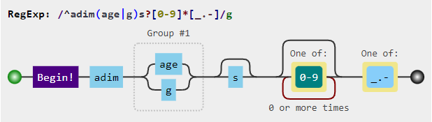
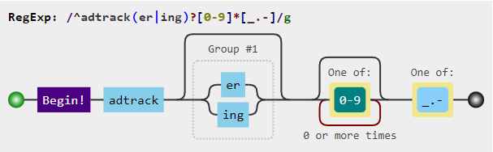
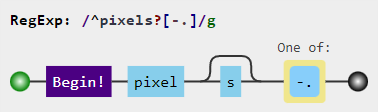

## 📋 Main regular expressions:
```regexp
^ad([sxv]?[0-9]*|system)[_.-]([^.[:space:]]+\.){1,}|[_.-]ad([sxv]?[0-9]*|system)[_.-]
^(.+[_.-])?adse?rv(er?|ice)?s?[0-9]*[_.-]
^(.+[_.-])?telemetry[_.-]
^adim(age|g)s?[0-9]*[_.-]
^adtrack(er|ing)?[0-9]*[_.-]
^advert(s|is(ing|ements?))?[0-9]*[_.-]
^aff(iliat(es?|ion))?[_.-]
^analytics?[_.-]
^banners?[_.-]
^beacons?[0-9]*[_.-]
^mads\.
^pixels?[-.]
```

## 🤔 Explanation
<div align="center">
    
    
    
    
    
    
    <br>
    <br>
    <br>
    <br>
    <br>
    
</div>

## 🗑️ Removed regular expressions
1. `^count(ers?)?[0-9]*[_.-]` - This expression has been removed because it was blocking access to [counter-strike.net](https://www.counter-strike.net).
2. `^stat(s|istics)?[0-9]*[_.-]` - It is blocking access to [stats.uptimerobot.com](https://stats.uptimerobot.com)

## 🔠 Source
https://github.com/mmotti/pihole-regex/blob/master/regex.list


<h3 align="right">
    <a href="https://extendsclass.com/regex-tester.html">Online Regex tester and visualizer »</a>
</h3>
