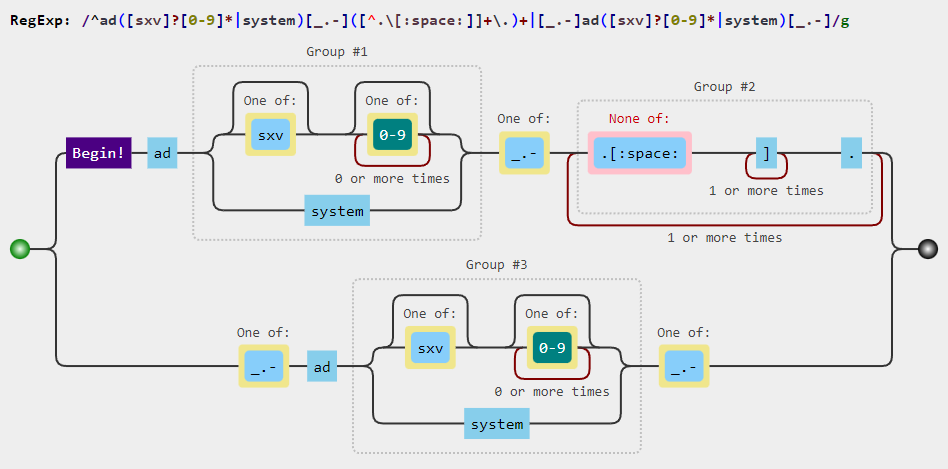
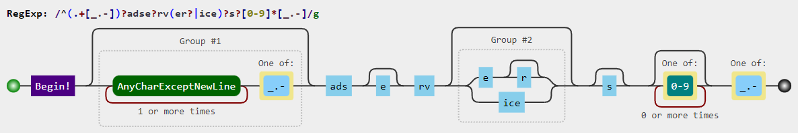
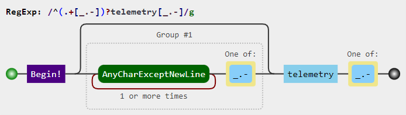
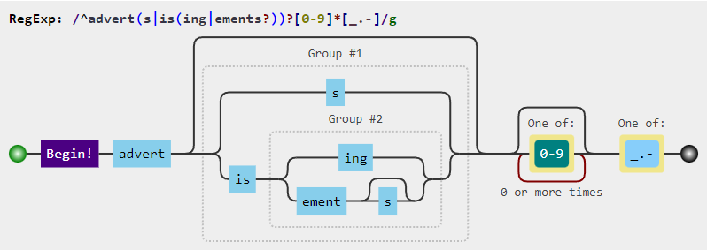
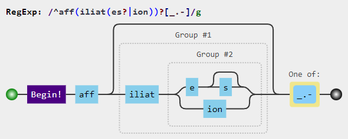
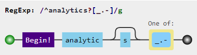
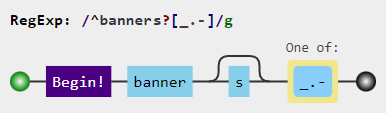
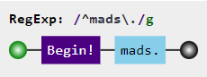
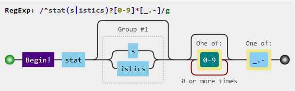
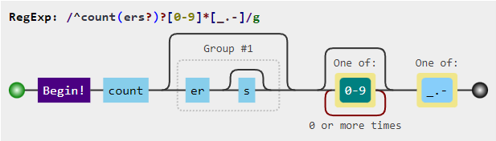

<h1 align="center">
    🔠 Regex filters provided by <a href="https://github.com/mmotti">MMotti</a>
</h1>


## 📋 Main regular expressions:
```regexp
^ad([sxv]?[0-9]*|system)[_.-]([^.[:space:]]+\.){1,}|[_.-]ad([sxv]?[0-9]*|system)[_.-]
^(.+[_.-])?adse?rv(er?|ice)?s?[0-9]*[_.-]
^(.+[_.-])?telemetry[_.-]
^adim(age|g)s?[0-9]*[_.-]
^adtrack(er|ing)?[0-9]*[_.-]
^advert(s|is(ing|ements?))?[0-9]*[_.-]
^aff(iliat(es?|ion))?[_.-]
^analytics?[_.-]
^banners?[_.-]
^beacons?[0-9]*[_.-]
^mads\.
^pixels?[-.]
^stat(s|istics)?[0-9]*[_.-]
```

## 🤔 Explanation
<div align="center">
    
    
    
    
    
    
    <br>
    <br>
    <br>
    <br>
    <br>
    <br>
    
</div>

## 🗑️ Removed regular expressions:
1. `^count(ers?)?[0-9]*[_.-]` - This expression has been removed because it was blocking access to [counter-strike.net](https://www.counter-strike.net).

## 🤔 Explanation
<div align="center">
    
</div>

<h3 style="display: flex; justify-content: space-between;">
    <div align="left"><a href="Index.md">« Go back - Index.md</a></div>
    <div align="right"><a href="https://extendsclass.com/regex-tester.html">Online Regex tester and visualizer »</a></div>
    <!-- fuck this shit lol idk how to write this -->
</h3>
